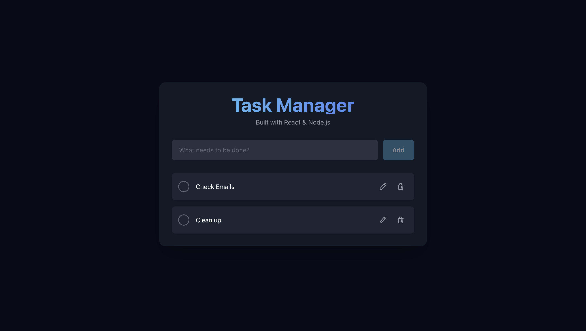

Full-Stack Task Manager (MERN Stack)
A complete task management application built with the MERN stack (MongoDB, Express, React, Node.js). It provides a clean, modern, and responsive user interface for managing daily tasks, complete with features for creating, editing, deleting, and filtering tasks.

ScreenShot:

Features
Full CRUD Functionality: Create, Read, Update, and Delete tasks.

Task Filtering: Easily filter the view to see all, active, or completed tasks.

Progress Tracking: A visual progress bar provides a quick overview of your completion percentage.

Responsive Design: A seamless user experience on both desktop and mobile devices.

Edit on Double-Click: Quickly edit task descriptions by double-clicking on them.

Clear Completed: A one-click button to remove all finished tasks and keep your list tidy.

Tech Stack
Frontend: React.js, Tailwind CSS, Axios

Backend: Node.js, Express.js

Database: MongoDB (with Mongoose)

Setup and Installation
To run this project locally, you will need two separate terminals.

1. Clone the Repository
git clone [https://github.com/JunoJupyter-design/Task-list-app](https://github.com/JunoJupyter-design/Task-list-app)
cd Task-list-app

2. Setup the Backend
# Navigate to the backend folder
cd backend

# Install dependencies
npm install

# Create a .env file in this directory
touch .env

# Add your MongoDB connection string to the .env file
MONGO_URI="your_mongodb_connection_string"

3. Setup the Frontend
# Navigate to the frontend folder from the root directory
cd frontend

# Install dependencies
npm install

4. Run the Application
You need to have both the backend and frontend servers running at the same time.

Terminal 1 (Backend):

# Navigate to the backend folder from the root
cd backend
node server.js

The backend will be running on http://localhost:5001.

Terminal 2 (Frontend):

# Navigate to the frontend folder from the root
cd frontend
npm start

The frontend will automatically open in your browser at http://localhost:3000.
